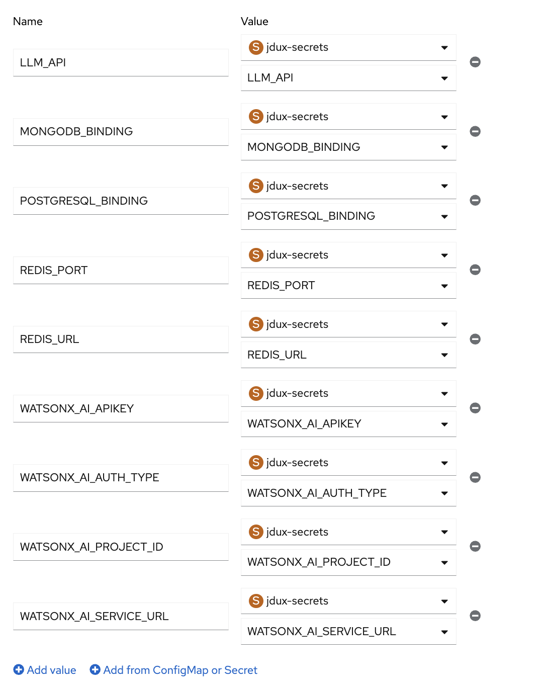

# Deploy a Cloud Native Application that uses Generative AI

This is a simple auto insurance underwriting application. The end user will fill out the form and upload an image of the front of a driver's license. The application will use this information to generate approve or reject the end user.


## Purpose

This demo demonstrates an unopinionated way of configuring and deploying various IBM Cloud components in the CLI, IBM Cloud console, and OpenShift Container Platform console.

It uses the console and deployable architectures for quickly provisioning resources, and a mix of CLI and web onsole for integrations.

## How the application works

When the end user submits information on the form, the backend uses two large language models (LLMs): 
- **Meta's Llama Vision** model: to scan a driver's license image to extract information 
- **IBM Granite** model: to execute a set of business rules (found in `services/llm/manual.md`) to evaluate whether the application should be underwritten

The application uses three IBM Cloud Databases (ICD):
- **Redis**: to queue several jobs as defined in `queues` (credit check, DMV check, license check, policy check, and an underwriting check)
- **MongoDB**: to store information about the applicant's (end user) insurance claim and make updates to it as jobs complete
- **PostgreSQL**: to store PII about the user in a table for fast querying


An archive of sample driver's licenses can be found at: https://github.com/microsoft/Federal-Business-Applications/blob/main/demos/ai-builder-drivers-license/README.md ; however, any dummy driver's license found online should be sufficient.

# Getting Started

You'll need the following components to complete this demo:
- IBM Cloud Secrets Manager
- Red Hat OpenShift on IBM Cloud
- IBM watsonx
- IBM Cloud Database for Redis
- IBM Cloud Database for MongoDB
- IBM Cloud Database for PostgreSQL

## 1. Create an IBM Cloud Secrets Manager instance

1) Go to [Creating a Secrets Manager instance](https://cloud.ibm.com/docs/secrets-manager?topic=secrets-manager-create-instance&interface=ui) to see how to create one with the console or CLI.
2) Once done, you will need to create an arbitrary secret using an IBM Cloud API Key to continue with the rest of the demo
    - Go to [API Keys](https://cloud.ibm.com/iam/apikeys) and click "Create". Make sure to take note of this API Key or copy it to your clipboard before continuing on.
3) In your Secrets Manager instance, click "Add +"
4) Select 'Other Secret Type'
5) Give the secret a name, then paste the API Key value in the 'Secret value' and complete the rest of the form.
6) You now have the API Key - in the form of a secret - managed by Secrets Manager. This will be used for authorizing against deployable architectures in the next sections.


## 2. Create the IBM Cloud Databases


1) Go to [IBM Cloud Projects](https://cloud.ibm.com/projects)
2) Create a new Project
3) Go to [IBM Cloud Community Catalog](https://cloud.ibm.com/catalog#deployable_architecture)
4) Find the tiles for:
   - Cloud automation for Databases for MongoDB
   - Cloud automation for Databases for PostgreSQL
   - Cloud automation for Databases for Redis 
   
   

5) Deploy these three DAs in the IBM Cloud Project you created.
   - The API Key - now stored as a secret in Secrets Manager - that was created in the previous section is used to authorize being able to use these deployable architectures.
   - Once configured, you'll need to Validate, Approve, and subsequently Deploy each of these services 

## 3. Create the Red Hat OpenShift on IBM Cloud cluster

The ROKS cluster is where the application will be deployed to. In the next sessions we'll go over deploying the application and giving access to the secrets we've created in previous sections. First, let's create the ROKS cluster.

1. Go to [IBM Cloud Official catalog](https://cloud.ibm.com/catalog?search=label%3Adeployable_architecture#all_products)
2. Find the tile for "Red Hat OpenShift Container Platform on VPC landing zone" 

3. Similar to the process with the ICD DAs, deploy this DA, too. You can use the Advanced configurations to deploy a cluster with a smaller flavor or spread the worker nodes across less worker zones.

Note: The deployment process can take an hour or so.

4. Once deployed, you can access the OCP console for your ROKS cluster in several ways. We'll use the [IBM Cloud Shell](https://cloud.ibm.com/shell).

5. Find the cluster ID of your ROKS cluster

```ibmcloud oc clusters```

6. Configure the environment so you can use `kubectl` and `oc` commands for your ROKS cluster

```ibmcloud oc cluster config -c <YOUR_CLUSTER_ID> --admin```

7. Create a new project to deploy your application to.

`oc new-project cnai`

## 4. Create the watsonx services

As mentioned before, we'll use watsonx to leverage a couple of foundational models.

1. Log in to [IBM watsonx](https://dataplatform.cloud.ibm.com/wx/home) 
2. Create a watsonx project by going to [Projects](https://dataplatform.cloud.ibm.com/projects/?context=wx)
3. Give it a name and select an IBM Cloud Object Storage (ICOS) instance; for the purposes of this demo, this can be the same ICOS instance that was created automatically with your ROKS cluster.
4. Click on the project you created and go to the "Manage" tab
5. Click on "Services & integrations" then click on "Associate service"
6. Click on "New service +" and select **watsonx.ai Runtime**
7. Associate the project with this service
8. Once complete, make note of the Project ID in the "General" tab; this will be used as a secret later.

## 5. Adding the secrets to the Red Hat OpenShift on IBM Cloud cluster

We'll add the secrets for watsonx and ICD to the ROKS cluster first, so that we can reference them in the Deployment at runtime.

There are several ways to do this:
- Individually adding each environment variable as a Secret or ConfigMap
- Binding ICD private endpoints to the ROKS cluster
- Integrating IBM Cloud Secrets Manager

We'll show examples of all three, but it is up to you to choose which path to take. Any combination of the three will work for the purposes of this demo.

The application uses these environment variables:

```
LLM_API=WATSONX
WATSONX_AI_AUTH_TYPE=iam
WATSONX_AI_SERVICE_URL=https://us-south.ml.cloud.ibm.com
WATSONX_AI_APIKEY=<YOUR-WATSONXAI-APIKEY>
WATSONX_AI_PROJECT_ID=<YOUR-WATSONXAI-PROJECT-ID>

REDIS_URL=<YOUR-ICDREDIS-URL>
REDIS_PORT=<YOUR-ICDREDIS-PORT>


MONGODB_BINDING= #mongodb-credentials.json (if running locally)
POSTGRESQL_BINDING= #postgresql-credentials.json (if running locally)
```

### 5.1 Using service bindings

Service bindings can be a quick way to bind the ICD databases to the ROKS cluster.

1. Go to the [IBM Cloud Shell](https://cloud.ibm.com/shell)
    - Make sure to log into the IBM Cloud account that has the resources you're working on in this demo
2. Look for the services you created throughout this demo 

```ibmcloud resource service-instances```

3. Find the name or ID of your ROKS cluster

```ibmcloud oc clusters```

4. Bind the ICD instance to the ROKS cluster through the private endpoint

```ibmcloud oc cluster service bind -c <CLUSTER_ID> -n <NAME_OF_PROJECT> --service <NAME_OF_ICD_INSTANCE>```

Note: If you don't include a project/namespace in the above command, the ICD instance will bind to the `default` project in your ROKS cluster. You should bind the ICD instance to the project in the cluster where you intend to deploy the application (i.e., to the `cnai` project that we created in the previous section).

5. Verify the secret is present

`oc get secrets -n cnai | grep "bind"`

6. Repeat this subsection for the rest of the ICD services

### 5.2 Manually configuring secrets as a ConfigMap

You can use OpenShift ConfigMaps to manually store secrets in your cluster's project.

1. Head to the OCP console by clicking the "OpenShift web console" button found on the Overview page of your ROKS cluster 

2. In the OCP console, make sure you're in the "Administrator" view.

3. Click ☰ and go to "Workloads", then "Secrets". 

4. Make sure you are in the `cnai` project, or the project you intend to deploy the application in. (again, Secrets are project-scoped).

5. Click "Create", and then "Key/value secret".


6. Give the ConfigMap a name like "watsonx-secret" and give the key(s) their respective names that the application will use at runtime and the values associated with them. For example with watsonx, recall the environment variables at the beginning of this secion.

### 5.3 Integrating IBM Cloud Secrets Manager

As a third option, you can use IBM Cloud Secrets Manager to centrally store and manage secrets then integrate it with your ROKS cluster for use.

1. Go to the [IBM Cloud Shell](https://cloud.ibm.com/shell)

2. Create a service ID and API Key

```export SERVICE_ID=`ibmcloud iam service-id-create openshift-secrets-tutorial --description "A service ID for testing ESO integration" --output json | jq -r ".id"`; echo $SERVICE_ID```

Note: The **SecretsReader** service access ensures the External Secrets controller has the correct level of access to read secrets from Secrets Manager and subsequently populate them in your ROKS cluster.

3. Create an IBM Cloud API key for your service ID

```export IBM_CLOUD_API_KEY=`ibmcloud iam service-api-key-create openshift-secrets-tutorial $SERVICE_ID --description "An API key for testing ESO integration." --output json | jq -r ".apikey"` ```

Note: This will be used later to configure Secrets Manager for your ROKS cluster deployment.

4. Click on "Add +" to create the secrets you want to use with your Secrets Manager instance. 
For watsonx secrets you can use 


5. For watsonx secrets, you can use "Other secret type" to store arbitrary values.


6. For ICD secrets, you can use "Key-value" to store the connection string in JSON format.


Or alternatively, you can create a secret using service credentials from the databases in your [IBM Cloud Database resources](https://cloud.ibm.com/databases-overview/resources).

Navigate to "Service credentials" then "Create credential +", select the Secrets Manager instance you're using, then click "Create".


Note: Make sure all secrets have been added to your Secrets Manager instance before moving on.

7. Back in the IBM Cloud Shell, set up External Secrets Operator in your ROKS cluster. Create a YAML file with the following content to install the External Secrets Manager.
```
echo '
apiVersion: v1
kind: Namespace
metadata:
  name: external-secrets-operator
---
apiVersion: operators.coreos.com/v1
kind: OperatorGroup
metadata:
  name: external-secrets-operator
  namespace: external-secrets-operator
spec:
  targetNamespaces:
    - external-secrets-operator
---
apiVersion: operators.coreos.com/v1alpha1
kind: Subscription
metadata:
  name: external-secrets-operator
  namespace: external-secrets-operator
spec:
  channel: stable
  installPlanApproval: Automatic
  name: external-secrets-operator
  source: community-operators
  sourceNamespace: openshift-marketplace
' | oc create -f-
```

8. Create a YAML file to configure authentication between External Secrets Operator and IBM Cloud Secrets Manager.
```
echo "
apiVersion: operator.external-secrets.io/v1alpha1
kind: OperatorConfig
metadata:
  name: cluster
  namespace: external-secrets-operator
spec: {}
---
apiVersion: v1
kind: Secret
metadata:
  name: secret-api-key
  namespace: default
type: Opaque 
stringData: 
  apikey: $IBM_CLOUD_API_KEY
" | oc create -f-
```

9. Apply both of these files to your cluster using:

`oc apply -f <NAME-OF-FILE>`

10. After you install External Secrets Operator in your cluster, you can define Secrets Manager as the secrets backend for your application. Start by creating a configuration file that targets the secret in Secrets Manager that you want to use. 

The first portion creates the SecretStore, which provides connection to IBM Cloud Secrets Manager, the second portion contains the secrets you'd like to reference from IBM Cloud Secrets Manager.

Note: Make sure you're in the correct project in your cluster before applying it or reference it when doing so.

```
apiVersion: external-secrets.io/v1beta1
kind: SecretStore
metadata:
  name: ibmcloud-secrets-manager
spec:
  provider:
    ibm:
      serviceUrl: <YOUR-IBMCLOUD-SECRETS-MANAGER-SERVICE-URL>
      auth:
        secretRef:
          secretApiKeySecretRef:
            name: <YOUR-IBMCLOUD-SECRETS-MANAGER-APIKEY>
            key: apikey
---
apiVersion: external-secrets.io/v1beta1
kind: ExternalSecret
metadata:
  name: ibmcloud-secrets-manager
spec:
  secretStoreRef:
    name: ibmcloud-secrets-manager
    kind: SecretStore
  target:
    name: ibmcloud-secrets-manager
  data:
    # example of a IBM watsonx secrets configuration
    - secretKey: WATSONX_AI_AUTH_TYPE
      remoteRef:
        key: <SECRET-KEY-UNIQUE-ID>
    - secretKey: WATSONX_AI_APIKEY
      remoteRef:
        key: <SECRET-KEY-UNIQUE-ID>
    - secretKey: WATSONX_AI_PROJECT_ID
      remoteRef:
        key: <SECRET-KEY-UNIQUE-ID>
    - secretKey: WATSONX_AI_SERVICE_URL
      remoteRef:
        key: <SECRET-KEY-UNIQUE-ID>
```
You can obtain the unique ID for each secret in your Secrets Manager by clicking on the secret and copying the ID in the "General" tab.

11. Once all the secrets for your IBM Cloud services are created, you can move on to Section 6.

## 6. Deploying the application to the ROKS cluster

If you've made it this far, then you're finally ready to deploy the application to the ROKS cluster. As a recap, you now have the following:

- Red Hat OpenShift on IBM Cloud cluster
- IBM Cloud Databases for Redis, MongoDB, and PostgreSQL
- watsonx
- the secrets associated with watsonx and ICD (visible in the ROKS cluster in any format from Sections 5.1, 5.2, and/or 5.3)

We'll switch over to the console now and revisit the CLI in the following section. 

1. Head to the OCP console by clicking the "OpenShift web console" button found on the Overview page of your ROKS cluster


2. In the OCP console, click on "Developer"


3. In the Developer view, click on "+Add" then "Import from Git"


Note: Make sure to be in the `cnai` project that you created from earlier. This is crucial as the secrets from the previous section are project-scoped.

4. Copy/paste the following URL into "Git Repo URL"

!!! Need to add Git URL once it becomes available !!!

5. Fill in the environment variables in the Deployment (runtime) configuration that you had finished adding as Secrets in the previous section.


Note: The "Name" should be the same as the screenshot, but the "Value" will differ depending on what options were chosen in Section 5.

7. Mount `/app/uploads` (where driver's licenses are stored) to a volume, so that licenses that the end user uploads can be stored on the node's storage the pod is associated with.
Go to the Deployment, select YAML view, then paste the following underneath the environment variables that are part of the Deployment.
```
     volumeMounts:
       - name: uploads
         mountPath: /app/uploads
volumes:
  - name: uploads
    mountPath: /app/uploads
```


Click "Save", then "Reload".

Note: This uses ephemeral storage. For persistence, you'll need a PVC mounted to `/app/uploads` to ensure that data is not lost if the pod is deleted. For the purpose of the demo, we will use ephemeral storage. You may need to re-build the Deployment and restart/delete the pod after Reload for changes to take effect.

8. Navigate to the "Topology" view in "Developer" and open the URL associated with the Pod.

Or perform: `oc get routes -n cnai` and navigate to the URL that is given. You should now be able to interact with the application.
